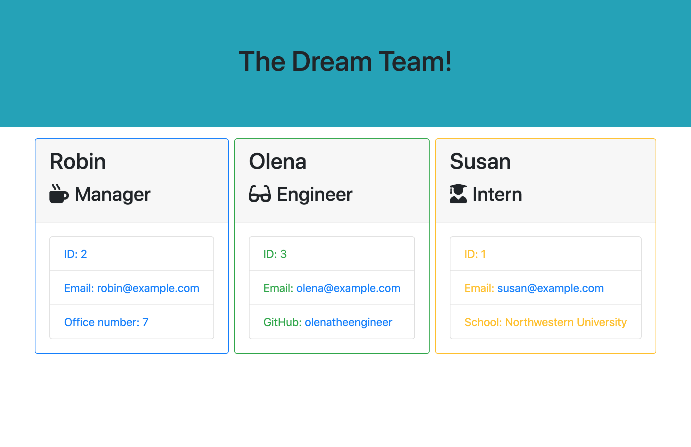

# Employee Summary Template Engine

[](https://www.gnu.org/licenses/gpl-3.0)

## Description

This is a software engineering team generator command line application. This application will prompt the user for information about the team. The user can input any number of team members whether they are managers, engineers or interns. When the user has completed building the team, the application creates an HTML file that displays a formatted team roster based on the information provided by the user.

## Table of Contents

* [Installation](#Installation)

* [Usage](#Usage)

* [License](#License)

* [Contributing](#Contributing)

* [Tests](#Tests)

* [Questions](#Questions)

## Installation

To install necessary dependencies, run the following command:
````
npm install
````

## Usage

To start the application (with Mac):

Navigate to file and type:
````
node app.js
````

Upon pressing enter, a prompt list of questions will appear and the user can answer the prompts accordingly:


When the prompts are finished, in the output folder there will be a team.html file that was generated with the corresponding information that the user had entered in the prompts.



## License

This project is licensed under the GPL 3.0 license.

## Contributing

[analexander] angale22@gmail.com

## Tests

To run tests, run the following command:
````
npm run test
````

## Questions

If you have any questions about the repo, open an issue or contact [analexander] directly at angale22@gmail.com.
